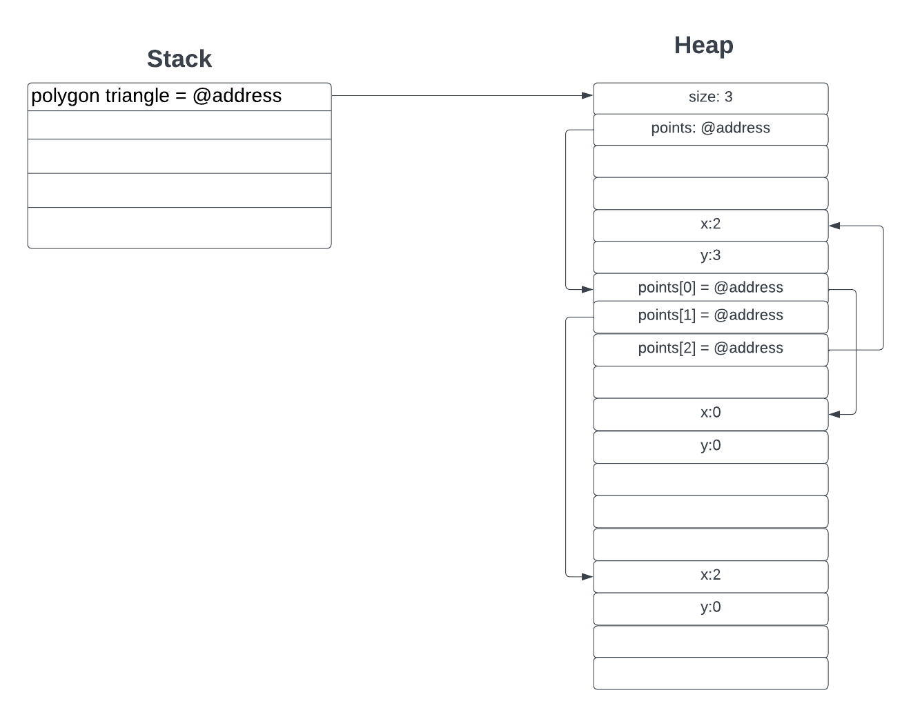

# Homework 2 Readme
Name: Jiawei Zhou

Github Account name: jwzhou1

Link to Assignment on Github: (copy and paste the link to your assignment repo here)

    https://github.com/jwzhou1/hw02.git

How many hours did it take you to complete this assignment (estimate)? 

    25 hours

Did you collaborate with any other students/TAs/Professors? If so, tell us who and in what capacity.  
- one per row, add more if needed

    No.


Did you use any external resources (you do not have to cite in class material)? (Cite them below)  
- one row per resource

    Yes. 

    For question 3:
    https://www.geeksforgeeks.org/stack-vs-heap-memory-allocation/#

    For question 5:
    https://www.geeksforgeeks.org/difference-between-malloc-and-calloc-with-examples/#

    For question 6:
    https://www.hackerearth.com/practice/notes/why-a-header-file-such-as-includestdioh-is-used/  
    https://www.tutorialspoint.com/c_standard_library/math_h.htm  
    https://www.fresh2refresh.com/c-programming/c-function/c-math-h-library-functions/  
    https://www.w3resource.com/c-programming/stdlib/index.php  


(Optional) What was your favorite part of the assignment? 

    I have learned that I should write function and tests at the same time.

(Optional) How would you improve the assignment? 

    I think it is better to have more pictures to show what it looks like when we run the main function.

## Understanding C Questions

1. What is the difference between a variable and a pointer?

    A variable is a named storage location that holds a value of a specific data type. For example: An integer variable can store integers. It is usually implemented on a computer as a block of memory space, characterized by an address and a size. A pointer, on the other hand, is a specialized variable that holds the memory address of another variable. In other words, a pointer points to the data that is contained in the memory address of another variable.

2. In your test file, we had the following code:
    
    ```c
    int* arr = create_array_of_ints_fib(5);
    int expected[] = {1, 1, 2, 3, 5};
    ```
    Later in the code we only `free(arr)` but not expected. Why is this? What is the difference in where they are stored in memory?

    In my test file, 'arr' is a pointer to an integer array that is created by calling the 'create_array_of_ints_fib' function with size = 5. This function dynamically allocates memory for an integer array of size 5 using 'malloc' function. 'arr' is a dynamically allocated array stored on the heap. So we have to free the dynamically allocated memory using free(arr) to avoid memory leaks. By calling free(arr), we are deallocating the memory that was previously allocated for the array of integers.

    On the other hand, 'expected' is an integer array declared on the stack. Unlike 'arr', which is dynamically allocated on the heap, 'expected' is automatically allocated on the stack and does not need to deallocate using 'free()'.

    Thus, the difference between 'arr' and 'expected' is that 'arr' is stored on the heap that needs to use free() but 'expected' is stored on the stack that does not need to use free().


3. What is the difference between the heap and stack when related to memory allocation and management?

    * In a stack, the allocation and de-allocation are automatically done by the compiler whereas, in heap, it needs to be done by the programmer manually.
    * Handling the Heap frame is costlier than handling the stack frame.
    * Memory shortage problem is more likely to happen in stack whereas the main issue in heap memory is fragmentation.
    * Stack frame access is easier than the heap frame as the stack has a small region of memory and is cache-friendly but in the case of heap frames which are dispersed throughout the memory so it causes more cache misses.
    * A stack is not flexible, the memory size allotted cannot be changed whereas a heap is flexible, and the allotted memory can be altered
    * Accessing the time of heap takes is more than a stack.

4. When you use `malloc`, where are you storing the information?

    When we use the 'malloc' function in C, it allocates a block of memory on the heap.

5. Speaking about `malloc` and `calloc`, what is the difference between the two (you may need to research it!)?

    * 'malloc' does not initialize the allocated memory but 'calloc' initializes the allocated memory to zero and 'calloc' ensures that each byte of the allocated memory block is set to zero.
    * 'malloc' takes a single argument, size, which represents the total size in bytes of the memory block to be allocated but 'calloc' takes two arguments, num and size. num represents the number of blocks to be allocated, and size represents the size of each block in bytes. 
    * 'malloc' is a function that creates one block of memory of a fixed size but 'calloc' is a function that assigns more than one block of memory to a single variable.
    * 'malloc' is used to indicate memory allocation but 'calloc' is used to indicate contiguous memory allocation.
    * 'malloc' has high time efficiency but 'calloc' has low time efficiency.
    * 'malloc' does not add any extra memory overhead but 'calloc' adds some extra memory overhead.

6. What are some common built in libraries used for C, list at least 3 and explain each one in your own words. Name a few functions in those libraries (hint: we used two of the most common ones in this assignment. There are many resources online that tell you functions in each library)?

    **First**: stdio.h: This library provides functions for standard input and output operations. We used stdio.h in this assignment. stdio.h includes functions for reading input from the user, writing output to the console, and working with files.

    Examples of functions in stdio.h:
    * printf(): This function is used to print the character, string, float, integer, octal and hexadecimal values onto the output screen.  
    * scanf(): This function is used to read a character, string, numeric data from keyboard.  
    * getc(): It reads character from file.  
    * gets(): It reads line from keyboard.  
    * clearerr(): This function clears the error indicators.  

    **Second**: math.h: This library provides functions for mathematical operations. All the functions available in this library take double as an argument and return double as the result.

    Examples of functions in math.h:
    * cos(): This function is used to calculate cosine.  
    * log(): This function is used to calculates natural logarithm.  
    * fabs(): This function is used to return the absolute value of the given number.  
    * sqrt(): This function is used to find square root of the argument passed to this function.  
    * pow(): This is used to find the power of the given number.  

    **Third**: stdlib.h: This library provides functions related to general-purpose utility operations, such as memory allocation, process control functions, random number generation, and type conversions.

    Examples of functions in stdlib.h:
    * calloc(): A memory allocator.
    * free(): Free allocated memory.
    * malloc(): A memory allocator.
    * atof(): Convert character string to float.
    * atoi(): Convert a string to an integer.
    * atol(): Convert a string to a long integer.
    * rand(): Pseudo-random number generator.
    * srand(): Pseudo-random number generator.


7. Looking at the struct Point and Polygon, we have a mix of values on the heap, and we make ample use of pointers. Take a moment to draw out how you think that looks after `create_triangle(2,3)` is called (see an example below). The important part of the drawing it to see that not everything is stored together in memory, but in different locations! Store the image file in your github repo and link it here. You can use any program to draw it such as [drawIO](https://app.diagrams.net/), or even draw it by hand and take a picture of it. 


### Linking to images?
To link an image, you use the following code

```markdown

```
for example
```markdown

```


Here is a sample using: 
```c
void my_func() {
    Polygon* r = create_rectangle(5,5);
    printf("The area of the rectangle is %d\n", area(r));
}
```


Note: This is a simplified version. However, it helps illustrate why we need to use `free` on the pointers in the struct. If we do not, we will have memory leaks! (memory that is allocated, but not freed, and thus cannot be used by other programs). In the above example code, `r` is created, and then the variable is destroyed when the function ends. However, the memory allocated for the struct is not freed, and thus we have a memory leak.

When you work on your version for `create_triangle(2, 3)`, you do not have to be exact on the memory structure (the locations on the heap were randomly chosen). The idea is more to show how the memory is stored, and the pointers to different memory addresses. 

